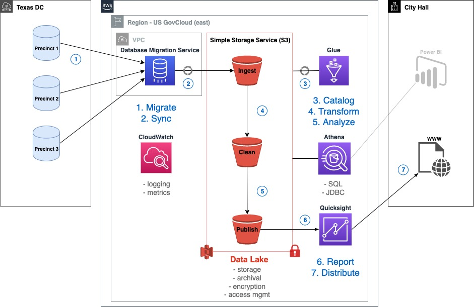
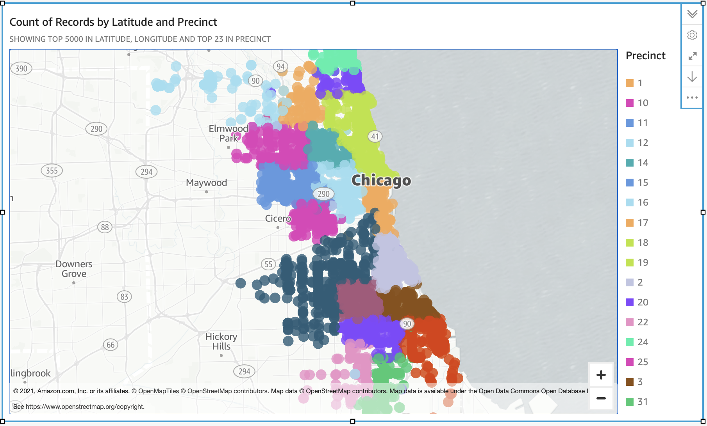

# Data Lake with CDK

This project demonstrates a data lake that aggregates data from silos of MySQL databases using DMS and Glue.  It uses crimes data from the City of Chicago that is prepared to represent disconnected police precincts.  The goal was to learn and be curious about building a data lake using CDK, and demonstrating the value of automation, access control, data security, and features of the included services: S3, Glue Catalog & ETL, Athena, Quicksight, and DMS.




# Getting started

## Visual Studio Code

The project is configured to use VS Code's Remote Container extension if installed.  Use the `Remote-Container: Reopen in Container` command to develop inside the AWS Glue Docker image and enable code hints for Glue jobs or running interactive Jupyter notebooks in the IDE.

## Loading data

Configure a unique environment name in cdk.json:
```json
{"context": {"env_name": "<unique_env_name>"}}
```
Deploy the environment:
```bash
source .venv/bin/activate
pip install -r requirements.txt
cdk deploy
```
Connect to the bastion host:
```bash
aws ssm start-session --target <bastion-id>
cd /home/ssm-user
```
Download data and store in S3 (1.6G - may take some time):
```bash
export AWS_ACCESS_KEY_ID=<access_key>
export AWS_SECRET_ACCESS_KEY=<secret_key>
export AWS_DEFAULT_REGION=<region>
sh ./download_crimes_data.sh
Bucket: <ingest_bucket>
```
Run sql script (host/pass from secrets manager console):
```
sudo yum install mysql
mysql -h <db_host> -u admin -P <db_port> -p < crimes_table.sql
Enter password: <db_passwd>
```

Run the workflow of transformation jobs:

- open the AWS Glue console
- start the `<env_name>-CrawlIngest` trigger

(Optional) Run database migration:

- open the Database Migration Service console
- run the `<env_name>-replicationtask` 

<i>This demonstrates migrating data from the precinct1 MySQL database.  The data for all precincts was already prepared by the `download_crimes_data.sh` script to simulate this step.</i>


# CDK Development

The `cdk.json` file tells the CDK Toolkit how to execute your app.

This project is set up like a standard Python project.  The initialization process also creates
a virtualenv within this project, stored under the .venv directory.  To create the virtualenv
it assumes that there is a `python3` executable in your path with access to the `venv` package.
If for any reason the automatic creation of the virtualenv fails, you can create the virtualenv
manually once the init process completes.

To manually create a virtualenv on MacOS and Linux:

```
$ python3 -m venv .venv
```

After the init process completes and the virtualenv is created, you can use the following
step to activate your virtualenv.

```
$ source .venv/bin/activate
```

If you are a Windows platform, you would activate the virtualenv like this:

```
% .venv\Scripts\activate.bat
```

Once the virtualenv is activated, you can install the required dependencies.

```
$ pip install -r requirements.txt
```

At this point you can now synthesize the CloudFormation template for this code.

```
$ cdk synth
```

You can now begin exploring the source code, contained in the hello directory.
There is also a very trivial test included that can be run like this:

```
$ pytest
```

To add additional dependencies, for example other CDK libraries, just add to
your requirements.txt file and rerun the `pip install -r requirements.txt`
command.

## Useful commands

 * `cdk ls`          list all stacks in the app
 * `cdk synth`       emits the synthesized CloudFormation template
 * `cdk deploy`      deploy this stack to your default AWS account/region
 * `cdk diff`        compare deployed stack with current state
 * `cdk docs`        open CDK documentation

Enjoy!
